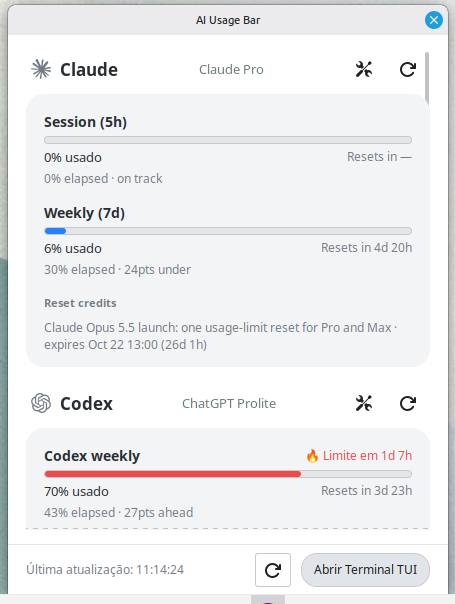
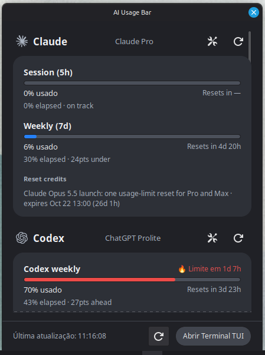

# Linux Mint / Cinnamon tray

## Screenshots

| Light | Dark |
|---|---|
|  |  |

There is no Mint frontend on upstream `main` to capture as "before".

This frontend uses the official `ai-usagebar usage --json` report. It does not
implement provider authentication, quota retrieval or caching. On Cinnamon/X11,
the GTK status icon opens the dashboard with a left click and the options menu
with a right click. The dashboard hides when it loses focus and stays out of
the taskbar. It uses Mint's XApp StatusIcon so the icon appears in the
XApp Status Applet. The runtime also has AyatanaAppIndicator and GTK fallbacks,
but this installer currently targets Mint and requires XApp.
The dashboard groups quota bars under each provider name and uses the provider
marks already shipped in [`omarchy/icons`](../omarchy/icons/README.md). Unknown
providers get a two-letter fallback. The marks are copied locally by the
installer; no icons are fetched from the network.
The interface uses English by default and Portuguese when `LANG` or
`LC_MESSAGES` starts with `pt`.
Each provider header has a settings button that opens its configuration guidance
and `config.toml`, plus a refresh button that reloads the shared usage report.
Bars follow the report's severity when no pacing data is available. With a
reset time and window duration, blue means usage is projected to leave at
least 10% spare, yellow means the projection is close to the limit, and red
with 🔥 means the limit is projected to be reached before reset. Providers
without credentials show **Não conectado** with expandable setup guidance.
For Antigravity, an expired saved session needs the public installed-app
`oauth_client_id` and `oauth_client_secret` in `[antigravity]` to refresh while
the app is closed. See the [configuration reference](../docs/configuration.md);
opening Antigravity temporarily refreshes its local session but does not
configure this closed-app fallback.

## Install

Install the official `ai-usagebar` and `ai-usagebar-tui` binaries in
`~/.local/bin/`, `~/.cargo/bin/`, `/usr/local/bin/` or `/usr/bin/` using the
[project instructions](../README.md). For a custom location, set
`AI_USAGEBAR_BIN` and `AI_USAGEBAR_TUI_BIN` to absolute executable paths when
running the installer. It saves these paths for future autostart sessions in
`~/.local/share/ai-usagebar/tray/binaries.json`.
On Linux Mint, install Python 3 and the GTK/XApp introspection packages:

```bash
sudo apt install python3-gi gir1.2-gtk-3.0 gir1.2-xapp-1.0
```

Then run:

```bash
./linux-mint/install.sh
```

The installer writes the tray script, presentation model, launcher, autostart
entry and icons under your home directory. It does not modify the official Rust
binaries or your `~/.config/ai-usagebar/config.toml` credentials and provider
settings.
The launcher uses a local socket to show the existing window, so starting it
twice does not create duplicate tray icons.

If a Cinnamon panel applet hides other applets, keep **XApp Status Applet** on
the visible side of that applet. Otherwise the tray icon will be hidden with
the rest of the status area even while this process is running.

Run `~/.local/bin/ai-usagebar-tray --window` to open the dashboard directly.
Use the tray menu to refresh usage, launch the TUI or quit.

## Development

```bash
python3 -m py_compile linux-mint/ai-usagebar-tray
make mint-test
make mint-runtime-test  # requires Python GTK introspection bindings
ai-usagebar usage --json
```

The Python frontend follows the report's `sections` list and the metric
`headline` contract (`percent` or `value`). It uses the `metrics` list when
`sections` is absent.
