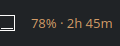
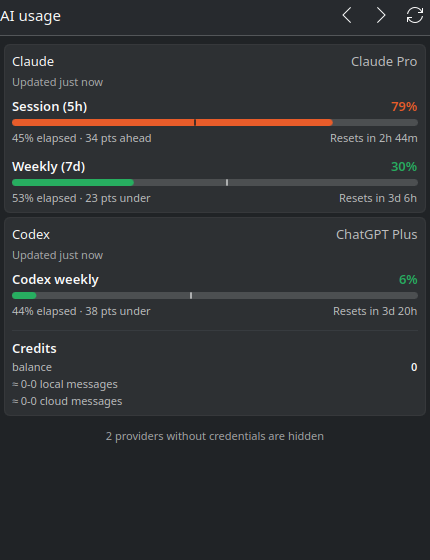

# KDE Plasma applet

This is the native KDE Plasma 6 frontend for ai-usagebar. It is a regular
KPackage applet (`Plasma/Applet`), so it installs with `kpackagetool6` and shows
up in *Add Widgets…* like any other widget.





Like the other frontends it is deliberately a display layer: it runs fixed
`ai-usagebar` commands, and the Rust binary remains the only code that reads or
writes configuration, talks to providers, manages refresh locks, and writes
caches.

## Install

The applet does not install its executable dependency. Install `ai-usagebar`
first, then the applet:

```bash
plasma/install.sh          # kpackagetool6 --install (or --upgrade) plasma/package
kquitapp6 plasmashell && (plasmashell &)
```

Then right-click the panel → *Add Widgets…* → **AI Usage Bar**. Remove it with:

```bash
kpackagetool6 --type Plasma/Applet --remove com.akitaonrails.aiusagebar
```

`plasmawindowed com.akitaonrails.aiusagebar` shows the applet in its own window,
which is the quickest way to look at a change without touching the panel.

## Controls

- Panel: left-click opens the popup, middle-click refreshes, and the mouse wheel
  switches provider. Hovering shows the current provider's card.
- Popup: the arrows switch provider, the circular arrow refreshes, and clicking
  a provider card makes it the one shown in the panel.
- Right-click (the applet's context menu): refresh, next/previous provider.

Providers without credentials are hidden from the popup and skipped when
switching, so a scroll never parks the panel on a `⚠`. Both behaviors are one
checkbox in the applet's settings.

Absolute reset timestamps are rendered as live countdowns, so an open popup
stays accurate between refreshes. Each bar also carries a marker at the elapsed
position of its window, which is what makes "35 pts ahead" visible at a glance.

## Commands it runs

| Command | Used for |
|---|---|
| `ai-usagebar [--vendor X] [extra args] --json` | Panel text (Pango markup converted to Qt rich text) |
| `ai-usagebar usage --json` | Tooltip and popup cards |
| `ai-usagebar settings show` | The default provider, once, at first start |

`usage` and `settings` are subcommands, and clap rejects `--vendor` (and the
other global options) next to them, so those command lines are built separately
from the panel one.

The applet keeps its own `activeVendor` in the widget's configuration rather
than calling `--cycle-next` / `--cycle-prev`. That keeps the scroll-cycle state
of a Waybar/TUI setup untouched, and it is what lets the frontend skip providers
that have no credentials and know which entry the tooltip should show.

## Settings

| Setting | Default | What it does |
|---|---|---|
| Binary path | `ai-usagebar` from `PATH` | Absolute path, if it is installed elsewhere |
| Interval | 60 s | How often the panel text is refreshed |
| Provider | *(cycled)* | Pins one provider and disables switching |
| Extra arguments | — | Passed verbatim, e.g. `--icon 󰚩 --format '{session_pct}%'` |
| Mouse wheel | on | Whether the wheel switches provider |
| Without credentials | hidden | Hide such providers in the popup and skip them when switching |

`$HOME/.local/bin` and `$HOME/.cargo/bin` are prepended to `PATH` for every run,
so a `cargo install`ed or tarball binary is found without configuration.

## Development

```bash
node plasma/model.test.mjs    # or: make desktop-test
```

`Model.js` holds every pure transformation (report normalization, provider
cycling, durations, detail parsing, the Pango conversion) and no QML globals, so
Node can exercise the report contract in CI the same way `omarchy/Model.js` is
tested. The test also checks the package contract: that every
`plasmoid.configuration.*` key used by the QML is declared in `main.xml`, and
that the translation catalog is named after the applet id.

Provider-controlled text is bounded and stripped of control characters and bidi
overrides in `Model.js`, and rendered with `Text.PlainText`. The only rich text
is the panel string, whose Pango spans are translated attribute by attribute
(colors are validated) and whose remaining markup is escaped.

## Translations

The catalog domain is `plasma_applet_com.akitaonrails.aiusagebar`, loaded from
`package/contents/locale/<lang>/LC_MESSAGES/`. `pt_BR` ships with the applet;
the compiled `.mo` is committed so a clone installs translated without gettext.

```bash
plasma/po/extract.sh                              # refresh the .pot, merge catalogs
cp plasma/po/plasma_applet_*.pot plasma/po/<lang>.po
msgfmt plasma/po/<lang>.po \
  -o plasma/package/contents/locale/<lang>/LC_MESSAGES/plasma_applet_com.akitaonrails.aiusagebar.mo
```

Metric labels ("Session (5h)", "Codex weekly", "Credits") are shown exactly as
the Rust report produces them — the frontend keeps no product- or metric-name
table of its own. Only the applet's own wording is translated, plus the pacing
hints it recomposes from the parsed `detail` values.
